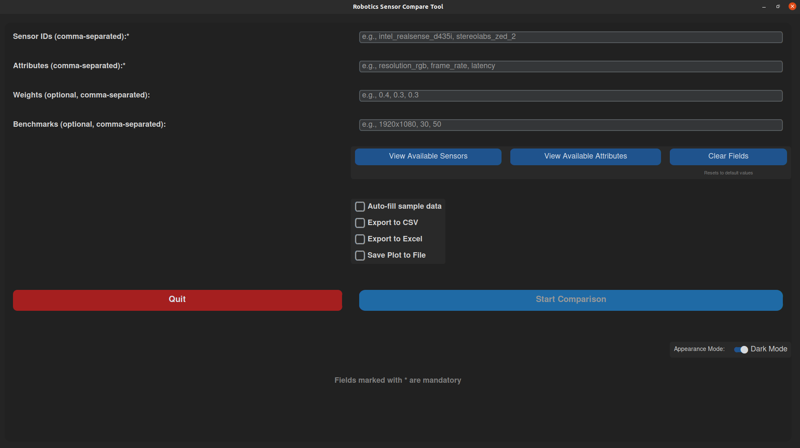

# Robotics Sensor Compare

An open-source, community-driven tool designed to help robotics enthusiasts, researchers, and developers select the most appropriate sensors for their projects. This tool provides a structured database of sensors, including detailed specifications and capabilities, focusing on vision sensors such as RGB cameras, infrared cameras, depth cameras, and LiDAR systems (to be added in the future).

## Table of Contents

- [Introduction](#introduction)
- [Features](#features)
- [Getting Started](#getting-started)
- [Usage](#usage)
  - [GUI Usage](#gui-usage)
  - [CLI Usage](#cli-usage)
- [Use Cases in Robotics](#use-cases-in-robotics)
- [Contributing](#contributing)
- [License](#license)
- [Data Attribution](#data-attribution)
- [Contact](#contact)

## Introduction

The Robotics Sensor Compare Tool aims to simplify the sensor selection process by providing a centralized, structured, and interactive platform for comparing and analyzing a wide array of sensors. It provides a structured database of sensors, including detailed specifications and capabilities. Users can filter, compare, and visualize sensor data to make informed decisions and select the most suitable sensors for their robotics applications. The project also aims to foster collaboration within the robotics community, encouraging contributions and updates from experts and enthusiasts alike.

## Features

- **Comprehensive Data**: Contains detailed specifications for a wide range of vision sensors, including RGB cameras, depth cameras, and LiDAR systems (to be added),sourced from publicly available manufacturers' datasheets.
- **Filter and Search Functionality**: Filter sensors based on type, manufacturer, resolution, field of view, ROS compatibility, frame rate, price range, and more.
- **Comparison and Visualization Tools**: Compare multiple sensors side by side based on key attributes to make informed decisions.
- **GUI and CLI Interfaces**: Use either the graphical user interface for an interactive experience or the command-line interface for quick operations and scripting.
- **Extensibility**: YAML-based sensor entries allow for easy contributions and modular updates, making it simple to expand the database with new sensor types and models.
- **Community-Driven**: Open for contributions from the community to expand the database and enhance functionality.

## Getting Started

Follow these instructions to clone the repository, set up the development environment, and begin using the tools.

### Prerequisites

Ensure you have Python 3.10 (or higher) and `git` installed on your system. Additionally, the repository uses `pandas`, `matplotlib`, `pyyaml`, `yamale`, `customtkinter`, and other libraries specified in `requirements.txt`.


### Setup Instructions

1. **Clone the repository**:
    ```bash
    git clone https://github.com/Sahil-cmd/robotics-sensor-compare.git
    cd robotics-sensor-compare
    ```

2. **Set up a virtual environment**:
    ```bash
    python3 -m venv venv
    source venv/bin/activate
    ```

3. **Install the required packages**:
    ```bash
    pip install -e .
    ```


## Usage

The Robotics Sensor Compare Tool can be used via both a graphical user interface (GUI) and a command-line interface (CLI), providing flexibility based on user preference. You can filter sensors, visualize comparisons, and validate new sensor entries.

### GUI Usage

The GUI provides an intuitive way to interact with the sensor database, allowing users to select sensors, attributes, and visualize comparisons.

#### Launching the GUI

You can launch the GUI in several ways:

Shortcut (after installation):

```bash
sensor-tool-gui
```

From the source directory:

```bash
python src/sensor_tool/gui/gui_main.py
```

Using the CLI command:
```bash
sensor-tool-cli gui
```

## GUI Features

- **Sensor Selection**: Choose sensors for comparison from the available database.
- **Attribute Selection**: Select attributes like `resolution_rgb`, `frame_rate`, `latency`, etc., for comparison.
- **Custom Weights**: Assign weights to attributes and set benchmarks based on your requirements.
- **Export Options**: Export comparison results to CSV or Excel, and save plots.
- **Visualization**: Generate comparison charts to easily analyze sensor performance.


## GUI Walkthrough

  
*Figure: Screenshot of the GUI for sensor comparison.*

**Steps**:
1. Launch the GUI:  
   ```bash
   sensor-tool-gui
   ```

2. **Select Sensors**: Click "View Available Sensors" and select the sensors to compare.
3. **Select Attributes**: Click "View Available Attributes" and choose the desired attributes.
4. **Set Weights/Benchmarks**: Optionally assign weights or benchmarks.
5. **Export/Visualize**: Use the export/visualize options to analyze and save results.


### CLI Usage

The CLI allows for quick operations and is suitable for scripting and automation.

#### Sensor Comparison
Compare sensors and visualize attributes.

Example Command:

```bash
sensor-tool-cli visualize \
  --sensor_ids intel_realsense_d435i stereolabs_zed_2 \
  --attributes resolution_rgb frame_rate latency \
  --weights 0.4 0.3 0.3
```

#### Filter Sensors

Filter by Manufacturer:
```bash
sensor-tool-cli filter --manufacturer "Intel"
```

Filter by Sensor Type and ROS Compatibility:

```bash
sensor-tool-cli filter --sensor_type "Depth Camera" --ros_compatibility "ROS1"
```
#### Validate Sensor Data

Validate sensor data files against the schema.

```bash
sensor-tool-cli validate sensors/**/*.yaml
```

## Use Cases in Robotics

### 1. Mobile Robot Navigation
   For mobile robots that need to navigate dynamically changing environments, sensors with a broad `field_of_view`, low `latency`, and suitable `min_range` are crucial.

   - **CLI Command**:
     ```bash
        sensor-tool-cli visualize \
        --sensor_ids intel_realsense_d435i stereolabs_zed_2 \
        --attributes field_of_view latency min_range
     ```
   - **Explanation**: This command visualizes and compares the field of view, latency, and minimum range, enabling users to choose the sensor that provides the best balance between wide coverage and quick response times for navigation purposes.

### 2. Precision Robotics (e.g., Pick and Place)
   Precision robotics applications often require sensors with high `frame_rate`, low `latency`, and high `resolution_rgb` to ensure precise object manipulation.

   - **CLI Command**:
     ```bash
        sensor-tool-cli visualize \
        --sensor_ids intel_realsense_d435i stereolabs_zed_2 \
        --attributes frame_rate latency resolution_rgb

     ```
   - **Explanation**: This command compares frame rate, latency, and RGB resolution to identify sensors capable of providing high frame rates and clear, detailed imagery for precision robotics tasks.

### 3. Outdoor Robotics (e.g., Agricultural Robots)
   Outdoor robots need sensors with high `max_range`, sufficient `field_of_view`, and balanced `price_range` for cost-effective scalability.

   - **CLI Command**:
     ```bash
        sensor-tool-cli visualize \
        --sensor_ids intel_realsense_d435i stereolabs_zed_2 \
        --attributes max_range field_of_view price_avg
     ```
   - **Explanation**: This comparison can help users choose sensors with the appropriate maximum range and field of view, while keeping costs within a feasible range for deployment in outdoor applications.

### 4. Underwater Robotics
   For underwater exploration, sensors must offer suitable `field_of_view`, `min_range`, `max_range`, and minimal `power_consumption`.

   - **CLI Command**:
     ```bash
        sensor-tool-cli visualize \
        --sensor_ids intel_realsense_d435i stereolabs_zed_2 \
        --attributes field_of_view min_range max_range power_consumption
     ```
   - **Explanation**: This command helps compare critical attributes like field of view, range, and power consumption, ensuring that selected sensors are efficient and functional within underwater environments.

### 5. Inspection Drones
   Drones used for inspections need lightweight sensors with low `power_consumption`, high `frame_rate`, and wide `field_of_view`.

   - **CLI Command**:
     ```bash
        sensor-tool-cli visualize \
        --sensor_ids intel_realsense_d435i stereolabs_zed_2 \
        --attributes power_consumption frame_rate field_of_view
     ```
   - **Explanation**: This comparison allows users to evaluate sensors based on energy efficiency, frame rate, and coverage, ensuring drones can perform longer inspections with real-time imaging.

### 6. Indoor Warehouse Automation
   In warehouse settings, sensors with precise `resolution_rgb`, high `frame_rate`, and low `latency` are needed for quick and accurate object sorting.

   - **CLI Command**:
     ```bash
        sensor-tool-cli visualize \
        --sensor_ids intel_realsense_d435i stereolabs_zed_2 \
        --attributes resolution_rgb frame_rate latency
     ```
   - **Explanation**: This command provides a detailed comparison of resolution, frame rate, and latency, allowing users to identify the most suitable sensor for high-speed sorting in warehouse environments.


## Contributing

Contributions are welcome and encouraged! To contribute:

1. Fork the repository.
2. Create a new branch (`git checkout -b feature/your-feature`).
3. Make your changes. Add new sensors, fix bugs, or implement new features.
4. Commit your changes (`git commit -m "feat: add new sensor model XYZ"`).
5. Push the branch (`git push origin feature/your-feature`).
6. Open a pull request.


## License

This project is licensed under the Apache License 2.0 - see the [LICENSE](LICENSE) file for details.

## Data Attribution

The data provided in this project has been sourced from publicly available datasheets, technical documentation, and resources hosted on the official websites of the respective sensor manufacturers. These include, but are not limited to:

- Intel (RealSense Cameras)
- StereoLabs (ZED Cameras)
- Mech-Mind (Mech-Eye Cameras)
- IDS (Ensenso Cameras)
- Zivid (Zivid Cameras)

For detailed specifications, please refer to the original datasheets available on the manufacturers' websites.

If you believe any data has been included in error or have questions regarding its usage, please contact the project maintainers.

## Contact

If you have any questions, suggestions, or need support, please open an issue on the GitHub repository or contact the project maintainers directly:

- **Maintainer**: Sahil Panjwani

